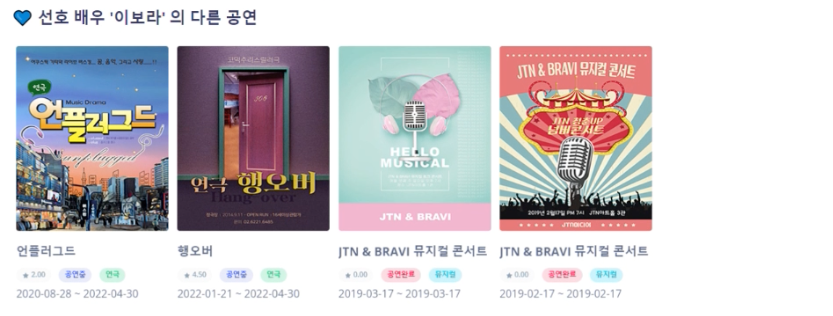
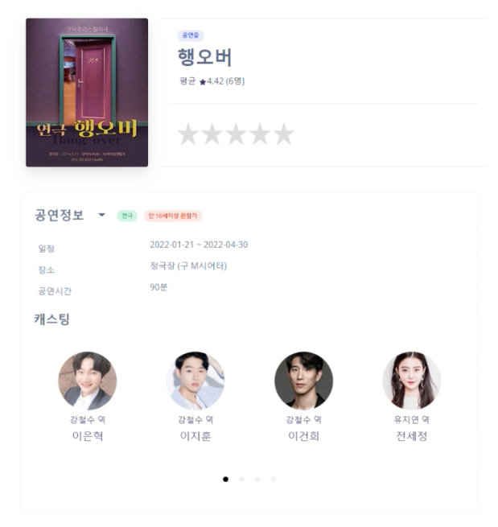
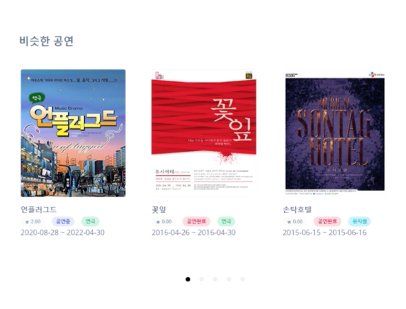
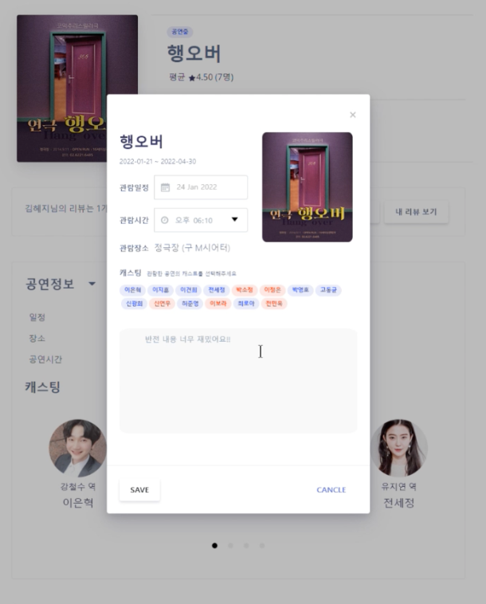
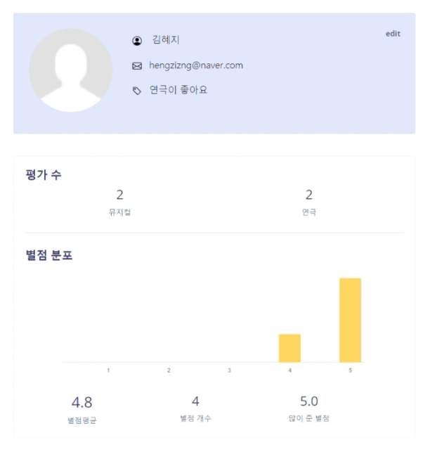
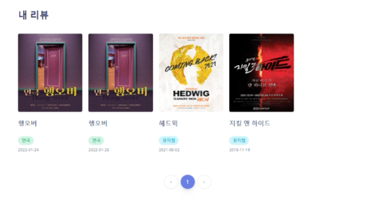
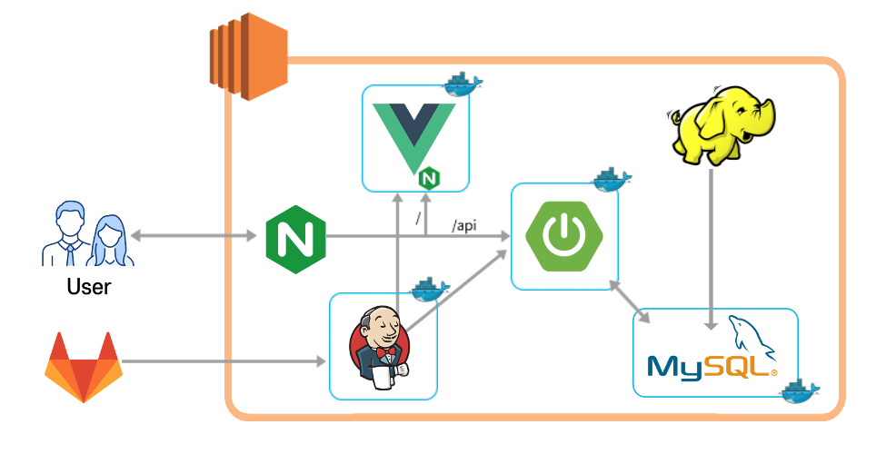
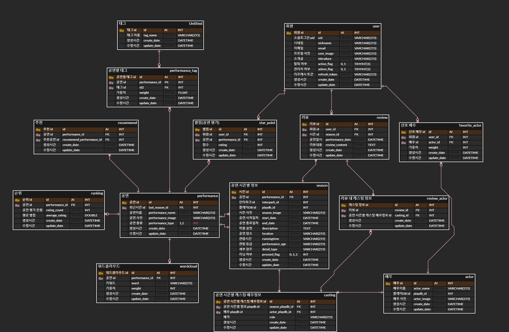

## 🗨️ Showing

> Showing은 뮤지컬/연극 소비자의 더 나은 경험과 선택을 위하여 공연의 세부 정보를 통한 뮤지컬/연극 추천 데이터 및 리뷰 분석을 통한 키워드 워드클라우드를 제공합니다.  
> 각 공연 당 별점 평가와 리뷰 작성이 가능하며, 다른 사람들의 리뷰 또한 확인 가능합니다.

<br>

## ✨ 주요 페이지

- 메인 페이지

  
  
  
  
  

- 공연 상세

  
  
  

- 리뷰

  

- 마이 페이지

  
  
  

<br>

## 🗓️ 진행 기간

2022.02.21~2022.04.08(총 7주)

<br>

## 🖊️ 팀원 소개

Backend : 김민준, 김혜지, 이명주

Frontend : 고주희, 송예진, 최혜린

Data : 고주희, 김민준, 송예진, 이명주

Hadoop : 김혜지, 최혜린

<br>

## 🏭 아키텍처



## 🔨 기술스택

### Front-End

- Node.js - `v14.15.1`
- npm - `v8.1.2`
- HTML 5, CSS3, JavaScript (ES6)
- Vue.js 2

## Back-End

- Java - `openjdk v1.8.0_192`
- Spring Boot - `v2.5.7`
- Django
- JPA, QueryDSL
- MySQL - `v8.0.27`
- Swagger - `v3`

## Data

- Hadoop HDFS
- Hadoop mapreduce
- Python
- Selenium

## Infra

- AWS EC2 Ubuntu 20.04
- Jenkins - [ jenkins/jenkins:lts ] - `v2.332.1`
- Nginx - `nginx/1.18.0 (Ubuntu)`
- Certbot - `certbot 1.25.0`
- Docker - `v20.10.13`

<br>

## 🔨 파일구조

[프로젝트 구조](https://broadleaf-crabapple-56b.notion.site/dfae4f46a3ee40eba813d49425fa9f8e)

<br>

## ✨ 산출물

### 화면 설계


### ERD



### API

[API 설계서](https://broadleaf-crabapple-56b.notion.site/API-9a5a758b6b074989ab66d53ca90184f6)

<br>

## 🏗️ 빌드 방법

원격의 git 저장소를 로컬에 복제

```shell
git clone https://github.com/hengzizng/Showing.git
```

### 백엔드

`DBDump.sql` 파일을 통해 로컬 MySQL에 DB 스키마를 생성

`application-prod.properties` 의 `spring.datasource.username` 과 `spring.datasource.password` 항목들을 로컬 MySQL에 만들어둔 정보에 맞춰 변경

backend 프로젝트를 빌드

```shell
cd backend
./gradlew clean build
```

`./gradlew: command not found` 오류가 발생한다면 gradlew에 실행 권한을 부여

```shell
chmod +x gradlew
```

생성된 jar 파일로 프로젝트를 실행

```shell
java -jar build/libs/backend-0.0.1-SNAPSHOT.jar
```

서비스 swagger 주소에 접속해 실행을 확인

- http://localhost:8081/swagger-ui/

### 프론트엔드

npm을 이용하여 필요한 패키지 설치

```shell
cd frontend
npm install
```

웹팩 개발 서버 구동

```shell
npm run serve
```

서비스 주소에 접속

- http://localhost:8080
